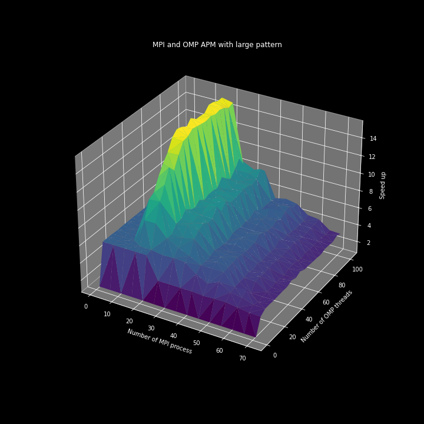

# High Performance Computing<br>DNA Approximate Pattern Matching (APM)

 

***Contributors :***  
*SAVES Marion & MARIE Nordine* students at TELECOM SudParis

## Compile :

### Compile all :

at root directory :  

```bash
./makeall.sh
```

### Compile separately :

at `apm/amp_<version>/` directory :

```bash
make clean
make
```

## Test them all :  

at root directory : 

```bash
./testall.sh
```

## Run OpenMP APM :

at `apm/apm_omp/` :

```bash
export OMP_NUM_THREADS=<N>
./apm <distance> <dna_file> <pattern>
```


## Run MPI APM :

at `apm/apm_mpi/` :

```bash
mpirun -np <N> --hostfile <hostfile> mpi ./apm <distance> <dna_file> <pattern>
```

## Run OpenMP + MPI APM :

at `apm/apm_omp_mpi/` :

```bash
mpirun -np <N> --hostfile <hostfile> mpi ./apm <distance> <dna_file> <pattern>
```

## Run CUDA APM :

at `apm/apm_omp/src/` :

```bash
./apm <distance> <dna_file> <pattern>
```

## Annexes :

- **Trace visualization** in `trace/` 
- **Speed up and efficiency plots** in `plots/`
- [**Human DNA files**](http://hgdownload.cse.ucsc.edu/goldenPath/hg38/chromosomes/)
- [**EZtrace**](https://eztrace.gitlab.io/eztrace/) was use to generate traces and [**ViTE**](https://solverstack.gitlabpages.inria.fr/vite/) to visualize them.
- Our **Jupyter notebook** `plot_speedup.ipynb` was used to plot the graphs present at `plots/`

All the tests have been done with the following hardware & configuration :

### Hardware for tests :

**Root computer :**  
*CPU :*   
Intel(R) Xeon(R) Silver 4116 CPU @ 2.10GHz
40 cores

*GPU :*  
Quadro P5000 16Go

**12 other computers :**  
i5-8400 CPU  
6 cores

**Root computer** was used for OpenMP, CUDA tests and was the MPI root process during MPI and OpenMP+MPI tests.

### Configuration for tests :

**DNA file :** `chr1_KI270763v1_alt.fa`

**Distance :** 5

**Small Pattern :** 32 characters

**Medium Pattern:** 96 characters (3 times small)

**Large Pattern :** 224 characters (7 times small)


